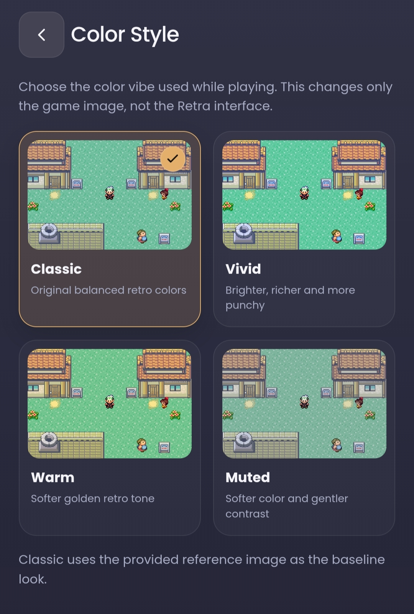

# Retra

**Retra v1.0.2** is the current stable release of Retra, an open-source Android retro emulator project built around mGBA with a strong focus on GBA gameplay, persistent game data, controller customization, and local/remote GBA link features. **v1.0.0** was the official first stable release, **v1.0.1** added portable backup/restore, and **v1.0.2** adds in-app update checking plus stronger reinstall recovery.

> Retra does not include commercial ROMs, BIOS files, or copyrighted game assets. Use only content you are legally permitted to use.

## Release status

- **Current version:** `v1.0.2`
- **Release channel:** Stable
- **Android:** API 26+ (Android 8.0+)
- **License:** Mozilla Public License 2.0 (MPL-2.0)
- **Maintainer:** Zense
- **Emulator core:** mGBA (separate upstream project)

Public release numbering now follows Semantic Versioning. Earlier project work is organized as pre-1.0 development milestones in [`docs/DEVELOPMENT_HISTORY.md`](docs/DEVELOPMENT_HISTORY.md).

### Development history

- **Retra v1.0.0** — Official release
- **Retra v1.0.1** — Added Create Backup and Restore Backup
- **Retra v1.0.2** — Added in-app update checking and Android reinstall-recovery hardening

## Highlights

- GB, GBC, and GBA emulation through the mGBA integration, with Retra's feature development primarily focused on GBA.
- Persistent ROM identity based on content hashes so compatible saves and metadata can reconnect after a ROM is moved, renamed, removed, or re-imported.
- Battery saves, save states, automatic resume, cheats, ROM patches, BIOS support, statistics, artwork, and per-ROM configuration.
- Portable **Create Backup** and **Restore Backup** support using `.retra` backup files.
- Automatic GitHub Releases update checks with a manual **Check for updates** action in About.
- Android Auto Backup/device transfer plus the platform **Keep app data** uninstall prompt for stronger reinstall continuity.
- Screen Editor with independent portrait and landscape layouts, draggable/resizable controls, emulator-screen resizing, and edge-aware editing.
- GBA Local Link plus Wi-Fi Remote Link and Bluetooth Remote Link for supported normal Link Cable flows.
- Adaptive 60/90/120 Hz interface presentation while keeping emulation timing independent from display refresh rate.
- Fast-forward and slow-motion speed controls, audio settings, Color Style presets, translucent appearance mode, controller opacity, and optional GLSL shaders.
- Google Drive sync with conflict-safe behavior plus Android Storage Access Framework folder fallback.
- Automatic artwork with persistent manual cover/background overrides.
- Modular Android architecture with release validation, regression tests, lint checks, and CI quality gates.

## Color Style

Retra includes lightweight gameplay color presets that affect only the rendered game image. The Retra interface itself remains unchanged.

Available presets: **Classic**, **Vivid**, **Warm**, and **Muted**.

<p align="center">
  
</p>

## Multiplayer scope

Retra v1.0.2 supports normal GBA Link Cable-style multiplayer through:

- **Local Link** on one Android device;
- **Wi-Fi Remote Link** between supported devices;
- **Bluetooth Remote Link** between supported Android devices.

Remote Link includes connection health metrics, heartbeat/timeouts, state-hash validation, jitter-aware input delay, host-authoritative recovery, bounded recovery retries, and deterministic input reseeding.

### Not supported in v1.0.2

- GBA Single-Pak / Multiboot
- GBA Wireless Adapter / RFU emulation

## Persistent game data

Retra separates replaceable ROM files from persistent user data.

```text
ROM content -> SHA-256 -> permanent romId
                         |
                         +-- Saves
                         +-- Save states
                         +-- Cheats
                         +-- Layouts
                         +-- Covers/backgrounds
                         +-- Categories/favourites
                         +-- Statistics
```

Structured ROM metadata is stored with Room, application-wide settings use Preferences DataStore, and save commits use verified temporary files, per-ROM locking, and rotating backups. Import recovery uses a durable journal so interrupted imports can be recovered safely.

See [`docs/PERSISTENT_STORAGE_ARCHITECTURE.md`](docs/PERSISTENT_STORAGE_ARCHITECTURE.md) for the current storage design.

## Build requirements

To build Retra from source you need:

1. Android Studio with the Android SDK required by the Gradle project.
2. The JDK/toolchain required by the included Android Gradle Plugin.
3. Android NDK **r28** and CMake **3.22.1**.
4. The exact locked mGBA source revision used by Retra.

Retra is pinned to mGBA commit `543a197582c30364584d773a974d7f991892fa43` through
`third_party/mgba.lock`. The preferred setup is:

```bash
python3 tools/prepare_mgba.py
```

That command prepares `third_party/mgba/` at the exact locked commit. CMake still accepts
the legacy sibling `../mgba/` location or an explicit `RETRA_MGBA_SOURCE_DIR`, but it
verifies that the source is the same clean locked revision before configuring the native build.

The Android release metadata is:

```text
versionName = 1.0.2
versionCode = 449
minSdk      = 26
```

`versionCode 449` makes v1.0.2 upgrade cleanly over v1.0.1 (`versionCode 448`) and v1.0.0 (`versionCode 447`).

## Open and build

1. Clone or extract the Retra repository.
2. Run `python3 tools/prepare_mgba.py` to prepare the exact locked mGBA checkout.
3. Open the repository root in Android Studio.
4. Let Android Studio sync Gradle and install the requested SDK/NDK/CMake components.
5. Build and run on an Android device.

For command-line checks on Windows:

```bat
gradlew.bat :app:compileDebugKotlin :app:testDebugUnitTest :app:lintDebug
```

On macOS/Linux:

```bash
./gradlew :app:compileDebugKotlin :app:testDebugUnitTest :app:lintDebug
```

A full APK/AAB build requires the exact mGBA revision recorded in `third_party/mgba.lock`; CMake rejects a different or dirty tracked checkout.

## Repository layout

```text
Retra/
├─ app/                         Android application
│  └─ src/main/
│     ├─ assets/retra/          WebView UI modules, styles, and branding
│     ├─ cpp/                   Native mGBA bridge and native build config
│     └─ java/.../emulator/     Android controllers, repositories, and runtime
├─ docs/                        Release, architecture, and engineering docs
│  └─ history/                  Archived implementation/build notes
├─ tests/                       Dependency-light regression tests
├─ third_party/                 Preferred project-local mGBA location
├─ tools/                       Release validation scripts
├─ CHANGELOG.md                 Public release and development history
├─ TROUBLESHOOTING.md           User troubleshooting and bug-reporting guide
├─ CONTRIBUTING.md              Contribution guide
├─ SECURITY.md                  Security policy
├─ THIRD_PARTY_NOTICES.md       Third-party licensing notices
└─ LICENSE                      MPL-2.0
```

See [`docs/README.md`](docs/README.md) for a documentation index.

## Validation

Run the dependency-light release gate before publishing changes:

```bash
python3 tools/release_gate.py
```

It validates JavaScript syntax, regression tests, release structure, and release metadata that do not require the Android SDK/NDK or mGBA.

For Android-specific validation, also run the Gradle compile/test/lint tasks shown above. Before publishing an APK/AAB, complete the physical-device checks in [`docs/RELEASE_CHECKLIST_v1.0.0.md`](docs/RELEASE_CHECKLIST_v1.0.0.md) and [`docs/REAL_DEVICE_VALIDATION_MATRIX_v1.0.1.md`](docs/REAL_DEVICE_VALIDATION_MATRIX_v1.0.1.md).

## Troubleshooting

For installation, ROM loading, gameplay performance, audio, controls, saves, backups, BIOS, multiplayer, Google Drive sync, and crash-reporting help, see [`TROUBLESHOOTING.md`](TROUBLESHOOTING.md).

## Release documents

- [`CHANGELOG.md`](CHANGELOG.md) — public changelog and pre-1.0 development milestones
- [`TROUBLESHOOTING.md`](TROUBLESHOOTING.md) — common issues, first-response steps, and bug-reporting guidance
- [`docs/RELEASE_NOTES_v1.0.0.md`](docs/RELEASE_NOTES_v1.0.0.md) — v1.0.0 release notes
- [`docs/RELEASE_CHECKLIST_v1.0.0.md`](docs/RELEASE_CHECKLIST_v1.0.0.md) — final publication checklist
- [`docs/DEVELOPMENT_HISTORY.md`](docs/DEVELOPMENT_HISTORY.md) — organized pre-v1.0 development history
- [`SECURITY.md`](SECURITY.md) — vulnerability reporting and security boundaries
- [`CONTRIBUTING.md`](CONTRIBUTING.md) — contribution requirements

## License and third-party software

Retra source code is released under the **Mozilla Public License 2.0 (MPL-2.0)**. See [`LICENSE`](LICENSE).

Retra integrates with the separately maintained **mGBA** emulator core. mGBA is not owned by Retra and retains its own copyright and MPL-2.0 notices. See [`THIRD_PARTY_NOTICES.md`](THIRD_PARTY_NOTICES.md) and the license files included with the exact mGBA revision used for your build.

ROMs, BIOS files, game artwork, trademarks, and game content are not distributed with Retra and remain the property of their respective rights holders.
